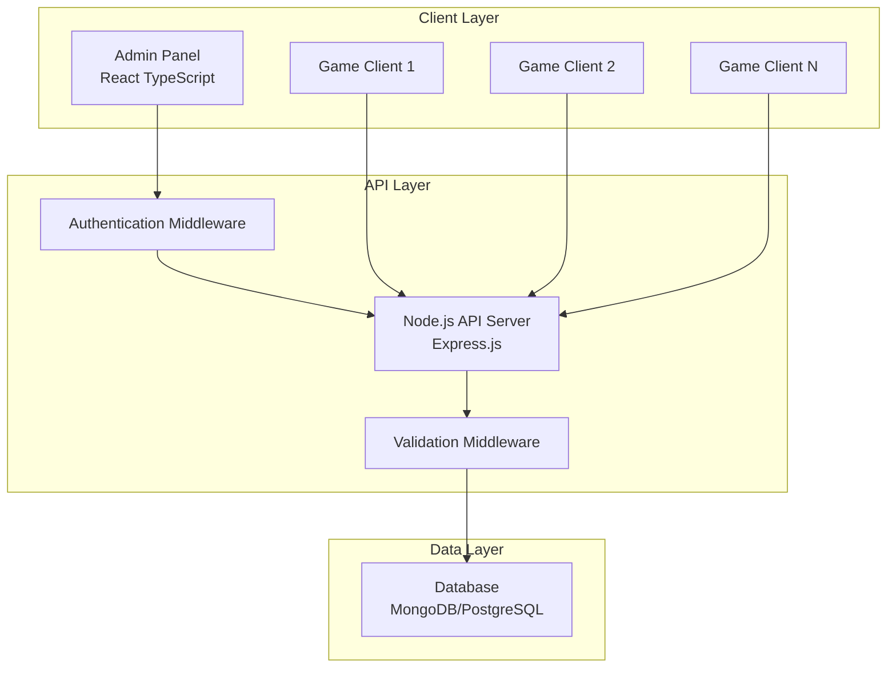

# Game Center Design Document

## Overview

ระบบ Game Center เป็น full-stack application ที่ประกอบด้วย 3 ส่วนหลัก:

- **Admin Panel**: React TypeScript frontend สำหรับจัดการข้อมูลเกม
- **API Server**: Node.js backend ที่ให้บริการ RESTful API
- **Database**: ระบบจัดเก็บข้อมูลเกม

ระบบใช้สถาปัตยกรรม client-server แบบแยกส่วน (decoupled) เพื่อความยืดหยุ่นและการบำรุงรักษาที่ง่าย

## Architecture



## Components and Interfaces

### 1. Admin Panel (React TypeScript)

**Core Components:**

- `LoginPage`: Authentication interface
- `Dashboard`: Main admin interface with game list
- `GameForm`: Form component for adding/editing games
- `GameList`: Table component displaying all games
- `GameCard`: Individual game display component

**Key Features:**

- Responsive design with modern UI framework (Material-UI หรือ Ant Design)
- Form validation with real-time feedback
- CRUD operations for game management
- Search and filter functionality
- Pagination for large datasets

**API Integration:**

```typescript
interface GameService {
  getAllGames(): Promise<Game[]>;
  getGameById(id: string): Promise<Game>;
  createGame(game: CreateGameRequest): Promise<Game>;
  updateGame(id: string, game: UpdateGameRequest): Promise<Game>;
  deleteGame(id: string): Promise<void>;
}
```

### 2. API Server (Node.js)

**Framework**: Express.js with TypeScript
**Architecture Pattern**: Layered Architecture (Controller → Service → Repository)

**API Endpoints:**

**Admin Endpoints:**

```
POST   /api/auth/login          - Admin authentication
GET    /api/admin/games         - Get all games (admin only)
POST   /api/admin/games         - Create new game (admin only)
PUT    /api/admin/games/:id     - Update game (admin only)
DELETE /api/admin/games/:id     - Delete game (admin only)
```

**Public Endpoints:**

```
GET    /api/games/:id           - Get game by ID (public)
GET    /api/games               - Get games with filters (public)
GET    /api/health              - Health check endpoint
```

**Middleware Stack:**

- CORS handling
- Request logging
- Authentication verification
- Input validation
- Error handling
- Rate limiting

### 3. Database Schema (MongoDB with Mongoose)

**Game Parent Collection:**

```typescript
interface GameParent {
  _id: ObjectId; // MongoDB ObjectId
  game_id: string; // Unique game identifier
  game_name: string; // Display name of the game
  created_at: Date; // Creation timestamp
  updated_at: Date; // Last update timestamp
  is_active: boolean; // Active status flag
}
```

**Game Details Collection:**

```typescript
interface GameDetails {
  _id: ObjectId; // MongoDB ObjectId
  game_id: string; // Reference to GameParent
  game_version: string; // Version number (e.g., "1.1")
  description: string; // Game description
  port: number; // Game server port
  api_url: string; // API endpoint URL
  type: "PROD" | "TEST" | "UAT"; // Environment type
  match_making_url: string; // Matchmaking service URL
  server_game_ip: string; // Game server IP address
  server_game_type: "UDP" | "TCP"; // Protocol type
  created_at: Date; // Creation timestamp
  updated_at: Date; // Last update timestamp
  is_active: boolean; // Active status flag
}
```

**Admin Collection:**

```typescript
interface Admin {
  _id: ObjectId; // MongoDB ObjectId
  admin_id: string; // Unique admin identifier
  username: string; // Login username
  password_hash: string; // Hashed password
  email: string; // Admin email
  role: string; // Admin role/permissions
  created_at: Date; // Account creation date
  last_login: Date; // Last login timestamp
}
```

## Data Models

### Request/Response Models

**Create Game Request:**

```typescript
interface CreateGameRequest {
  game_id: string; // Will create parent if not exists
  game_name: string; // Will create parent if not exists
  game_version: string;
  description: string;
  port: number;
  api_url: string;
  type: "PROD" | "TEST" | "UAT";
  match_making_url: string;
  server_game_ip: string;
  server_game_type: "UDP" | "TCP";
}
```

**Game Response (Combined View):**

```typescript
interface GameResponse {
  game_id: string;
  game_name: string;
  game_version: string;
  description: string;
  port: number;
  api_url: string;
  type: "PROD" | "TEST" | "UAT";
  match_making_url: string;
  server_game_ip: string;
  server_game_type: "UDP" | "TCP";
  is_active: boolean;
}
```

**Game Parent Response:**

```typescript
interface GameParentResponse {
  game_id: string;
  game_name: string;
  versions: GameDetails[]; // Array of all versions for this game
  is_active: boolean;
}
```

**API Response Wrapper:**

```typescript
interface ApiResponse<T> {
  success: boolean;
  data?: T;
  message?: string;
  error?: string;
  timestamp: string;
}
```

## Error Handling

### API Error Responses

**Standard Error Format:**

```typescript
interface ErrorResponse {
  success: false;
  error: string;
  message: string;
  code: string;
  timestamp: string;
  details?: any;
}
```

**HTTP Status Codes:**

- `200` - Success
- `201` - Created
- `400` - Bad Request (validation errors)
- `401` - Unauthorized
- `403` - Forbidden
- `404` - Not Found
- `409` - Conflict (duplicate game_id)
- `500` - Internal Server Error

### Frontend Error Handling

- Global error boundary for React components
- Toast notifications for user feedback
- Form validation with inline error messages
- Retry mechanisms for failed API calls
- Graceful degradation for network issues

## Testing Strategy

### Backend Testing

**Unit Tests:**

- Service layer business logic
- Validation functions
- Database operations
- Authentication middleware

**Integration Tests:**

- API endpoint testing
- Database integration
- Authentication flow
- Error handling scenarios

**Tools:** Jest, Supertest, MongoDB Memory Server

### Frontend Testing

**Unit Tests:**

- Component rendering
- Form validation
- Service functions
- Utility functions

**Integration Tests:**

- User workflows
- API integration
- Form submissions
- Navigation flows

**E2E Tests:**

- Complete admin workflows
- Game CRUD operations
- Authentication scenarios

**Tools:** Jest, React Testing Library, Cypress

### API Testing

**Automated Tests:**

- All endpoint functionality
- Authentication requirements
- Input validation
- Error responses
- Performance benchmarks

**Manual Testing:**

- Postman collection for API testing
- Load testing with multiple concurrent requests
- Security testing for authentication

## Security Considerations

### Authentication & Authorization

- JWT-based authentication for admin panel
- Secure password hashing (bcrypt)
- Session management and token expiration
- Role-based access control

### API Security

- Input validation and sanitization
- SQL injection prevention
- Rate limiting to prevent abuse
- CORS configuration
- HTTPS enforcement in production

### Data Protection

- Sensitive data encryption
- Secure database connections
- Environment variable management
- Audit logging for admin actions

## Performance Optimization

### Backend Optimization

- Database indexing on frequently queried fields
- Connection pooling
- Caching for frequently accessed data
- Pagination for large datasets
- Compression middleware

### Frontend Optimization

- Code splitting and lazy loading
- Memoization for expensive operations
- Optimized bundle size
- CDN for static assets
- Progressive loading for large lists

## Deployment Architecture

### Development Environment

- Local development with hot reload
- Docker containers for consistent environment
- Environment-specific configuration

### Production Environment

- Load balancer for API scaling
- Database clustering/replication
- CDN for frontend assets
- Monitoring and logging
- Automated backup systems
